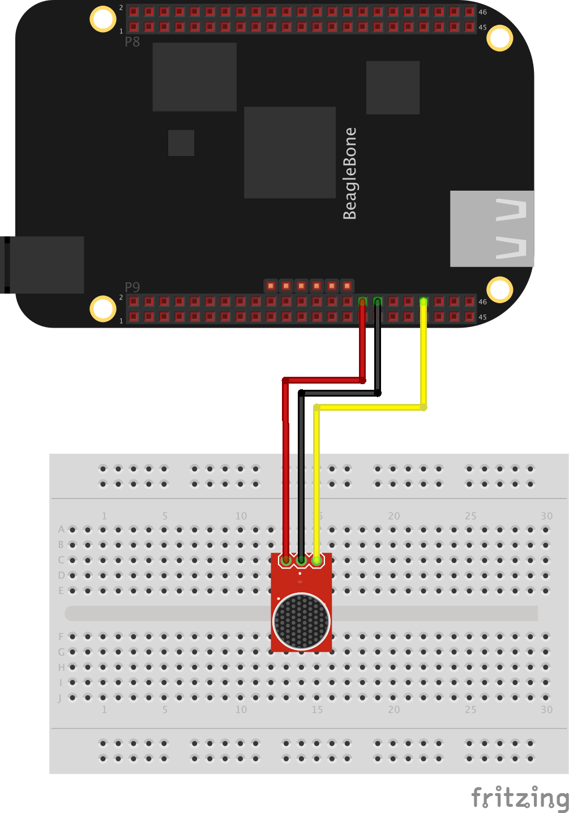

##Monitor a Micophone using Zetta and bonescript!

###Install

```
$> npm install zetta-microphone-bonescript-driver
```

###Usage

```
var zetta = require('zetta');
var Microphone = require('zetta-microphone-bonescript-driver');
Â
zetta()
  .use(Microphone, 'P9_36')
  .listen(1337)
```

### Hardware

* [Beagle Bone](http://beagleboard.org/black)
* [Electret Microphone](https://www.sparkfun.com/products/9964)
* 2.2K Ohm Resistor



###Streams

#####amplitude

Amplitude, relative to 0-1.8v
